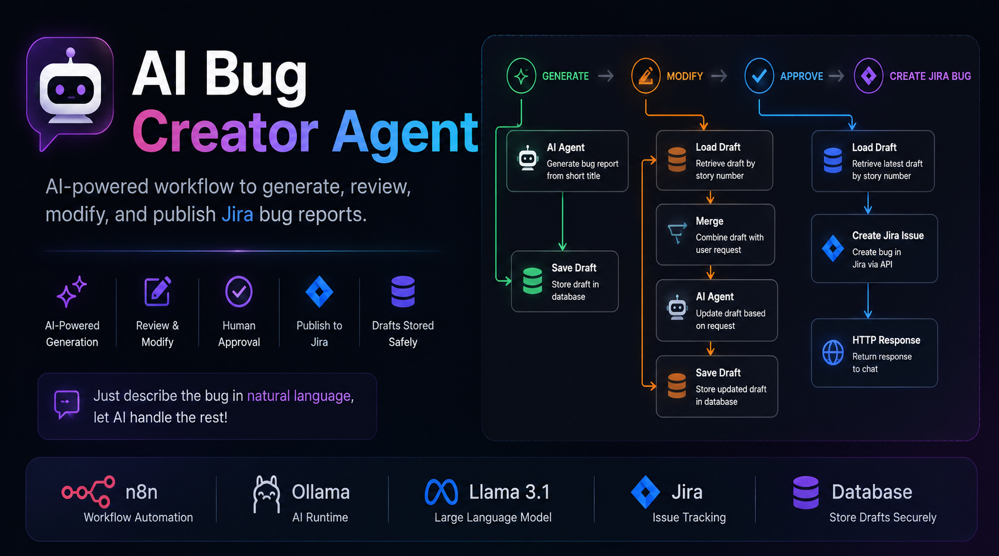
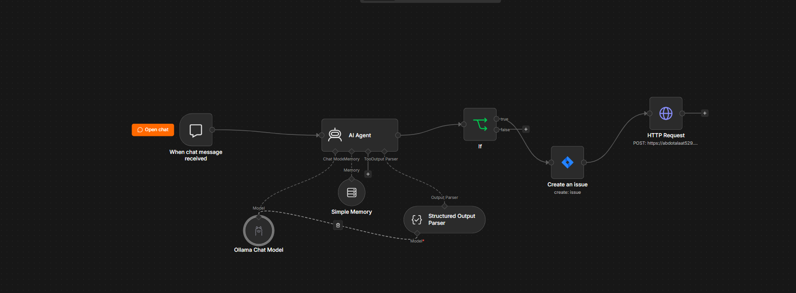

<p align="center">
  
</p>

<h1 align="center">🚀 AI Bug Creator Agent</h1>

<p align="center">
  AI-powered workflow to generate, review, modify, and publish Jira bug reports.
</p>

<p align="center">
Built with <strong>n8n</strong> • <strong>Model-Agnostic</strong> • Supports <strong>Google Gemini</strong> &amp; <strong>Ollama (Llama 3.1)</strong>
</p>

<p align="center">
  
  
</p>

<p align="center">
  
  
  
  
</p>

---

# 📖 Overview

**AI Bug Creator Agent** is an AI-powered automation workflow built with **n8n** that helps QA Engineers generate high-quality Jira bug reports through an AI-assisted draft and approval process.

Instead of manually writing a complete bug report, users only need to provide:

- Story Number
- A short bug title

The workflow automatically routes the request through one of three actions:

- **Generate** → AI creates a complete bug report draft and stores it in the database.
- **Modify** → AI updates an existing draft based on user feedback.
- **Approve** → The latest approved draft is published as a Jira Bug.

Unlike traditional AI bug creators, this workflow introduces a **draft-review cycle**, allowing users to iteratively refine AI-generated bug reports before publishing them to Jira.

---
## 📑 Table of Contents

- Overview
- Features
- Workflow
- Tech Stack
- Installation
- Usage
- Examples
- Repository Structure
- Future Improvements
- Contributing
---

# ✨ Features

- AI-powered bug generation
- Chat-based workflow
- Generate complete bug reports from a short bug title
- Draft-first workflow
- Store bug drafts in a database
- Modify drafts using natural language
- Human approval before publishing
- Automatically create Jira Bug Issues
- Supports Google Gemini and Ollama (Llama 3.1)
- Built with n8n AI Agent
- Jira REST API integration
- Extensible architecture

---

# 🏗 Workflow Architecture

```text
                 Chat Trigger
                      │
                      ▼
                Parse Message
                      │
                      ▼
                    Switch
             ┌────────┼────────┐
             │        │        │
             ▼        ▼        ▼
        Generate   Modify   Approve
             │        │        │
             ▼        ▼        ▼
         AI Agent  Load Draft Load Draft
             │        │        │
             ▼        ▼        ▼
        Save Draft   Merge   Create Jira Issue
        (Database)     │          │
                       ▼          ▼
                  AI Agent   HTTP Response
                       │
                       ▼
                  Save Draft
```

---

# 📸 Workflow

<p align="center">
  
</p>

The workflow follows a **draft-first** approach. AI generates a complete bug report, users can iteratively refine it through natural language, and only approved drafts are published to Jira.

---

# ⚙️ Tech Stack

| Technology | Purpose |
|------------|---------|
| n8n | Workflow Automation |
| AI Agent | Bug Report Generation & Draft Refinement |
| Google Gemini *(Optional)* | Cloud Large Language Model |
| Ollama *(Optional)* | Local AI Runtime |
| Llama 3.1 *(via Ollama)* | Local Large Language Model |
| Database | Store and Manage Bug Drafts |
| Jira Cloud API | Create Jira Bug Issues |
| HTTP Request | External Integrations & Notifications |

> **AI Model Flexibility**
>
> This workflow is model-agnostic.
> It has been tested with **Google Gemini** and **Llama 3.1 via Ollama**, but any LLM supported by n8n can be integrated with minimal changes.

---

# 📦 Installation

## 1. Clone the Repository

```bash
git clone https://github.com/AbdulrhmanTalaat/AI-Bug-Creator-Agent.git
```

---

## 2. Import the Workflow

Import the workflow into your n8n instance.

```text
workflow/AI Bug Creator Agent.json
```

---

## 3. Configure an AI Model

This workflow is **model-agnostic** and supports multiple AI providers.

Choose the provider that best fits your environment.

### Supported AI Providers

```text
Google Gemini (Cloud)
        OR
Ollama + Llama 3.1 (Local)
```

### Google Gemini (Cloud)

Use Google Gemini if you prefer a managed cloud-based AI service.

**Setup**

- Create a Google Gemini API Key.
- Configure the **Google Gemini Chat Model** node in n8n.
- Select your preferred Gemini model (e.g., Gemini 2.5 Flash).

---

### Ollama + Llama 3.1 (Local)

Use Ollama if you want to run the workflow completely offline.

Install Ollama and pull the Llama model.

```bash
ollama pull llama3.1:8b
```

Then connect the **Ollama Chat Model** node to the AI Agent.

> **Note**
>
> Since the workflow is model-agnostic, you can also replace these providers with any LLM supported by n8n, such as OpenAI or Anthropic Claude.

---

## 4. Configure Jira

Update your Jira credentials inside n8n.

Configure:

- Jira URL
- Email
- API Token
- Project Key
- Issue Type (Bug)

---

## 5. Configure the Draft Database

Configure your preferred database to store bug drafts.

Each draft should be linked to its **Story Number** so it can be retrieved during the **Modify** and **Approve** steps.

---

## 6. Run the Workflow

The workflow supports three chat commands.

---

### 🟢 Generate

The user starts by asking the AI to generate a bug draft.

**Input**

```text
Generate

Story: SDB-123

Title:
Login button does nothing after entering valid credentials.
```

**Workflow**

- Parse the user message
- Generate a complete bug report using AI
- Store the generated draft in the database

---

### 🟠 Modify

The user can request changes to an existing draft.

**Input**

```text
Modify

Story: SDB-123

Please mention that the issue only occurs in Microsoft Edge.
```

**Workflow**

- Retrieve the latest draft
- Merge the draft with the user's requested changes
- Update the bug report using AI
- Save the updated draft

---

### 🔵 Approve

Once the user is satisfied with the draft, it can be published to Jira.

**Input**

```text
Approve

Story: SDB-123
```

**Workflow**

- Retrieve the latest draft
- Create the Jira Bug
- Return the created Jira Issue

---

# 💬 Example Workflow

## Step 1 — Generate

### User

```text
Generate

Story: SDB-123

Title:
Profile changes are not saved.
```

### AI Result

- Creates a complete bug report
- Saves the report as a draft

---

## Step 2 — Modify

### User

```text
Modify

Story: SDB-123

Add that the issue only occurs in Firefox.
```

### AI Result

- Retrieves the latest draft
- Updates the bug report
- Saves the new draft

---

## Step 3 — Approve

### User

```text
Approve

Story: SDB-123
```

### AI Result

- Retrieves the latest draft
- Creates the Jira Bug
- Returns the created Jira Issue ID

---

# 📄 Example Draft

```json
{
  "storyNumber": "SDB-123",
  "summary": "Profile changes are not saved",
  "description": "When editing a user profile and clicking the Save button, the page remains in a loading state indefinitely. No confirmation or error message is displayed, and the changes are not persisted.",
  "stepsToReproduce": [
    "Open Profile page",
    "Edit profile information",
    "Click Save"
  ],
  "expectedResult": "Profile changes should be saved successfully.",
  "actualResult": "The page remains loading indefinitely and no changes are saved.",
  "issueType": "Bug",
  "status": "Draft"
}
```

---

# 📄 Example After Approval

```json
{
  "storyNumber": "SDB-123",
  "jiraIssueKey": "BUG-452",
  "jiraIssueUrl": "https://your-domain.atlassian.net/browse/BUG-452",
  "status": "Created"
}
```

---

# 📂 Repository Structure

```text
.
├── README.md
├── LICENSE
├── .gitignore
├── workflow/
│   └── AI Bug Creator Agent.json
├── screenshots/
│   ├── banner.png
│   └── workflow.png
└── docs/
```

---

# 🎯 Project Scope

This project demonstrates how AI can automate the complete bug reporting lifecycle using a draft-first workflow.

Instead of immediately publishing AI-generated bug reports, users can:

- Generate a draft
- Review the generated content
- Modify the draft using natural language
- Approve the final version
- Publish it automatically to Jira

This approach improves bug quality while keeping the reporting process fast and efficient.

The workflow is lightweight, extensible, and can easily be integrated with different databases, issue trackers, or Large Language Models.

---

# 🤝 Contributing

Contributions are always welcome!

If you'd like to improve this project:

1. Fork the repository.
2. Create a feature branch.
3. Commit your changes.
4. Open a Pull Request.

Bug reports, feature requests, and suggestions are greatly appreciated.

---

# 👨‍💻 Author

**Abdulrhman Talaat**

Senior Software Test Engineer

[](https://github.com/AbdulrhmanTalaat)

If you found this project useful, consider giving it a ⭐ on GitHub.